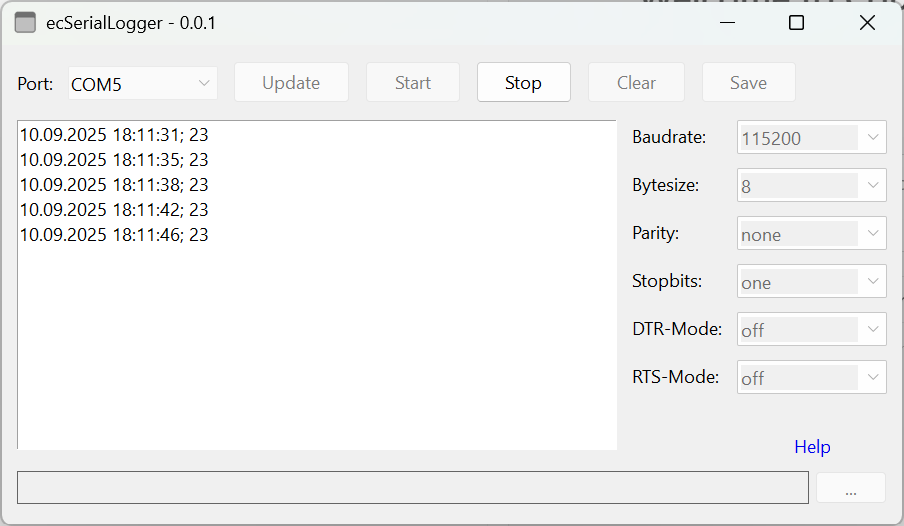
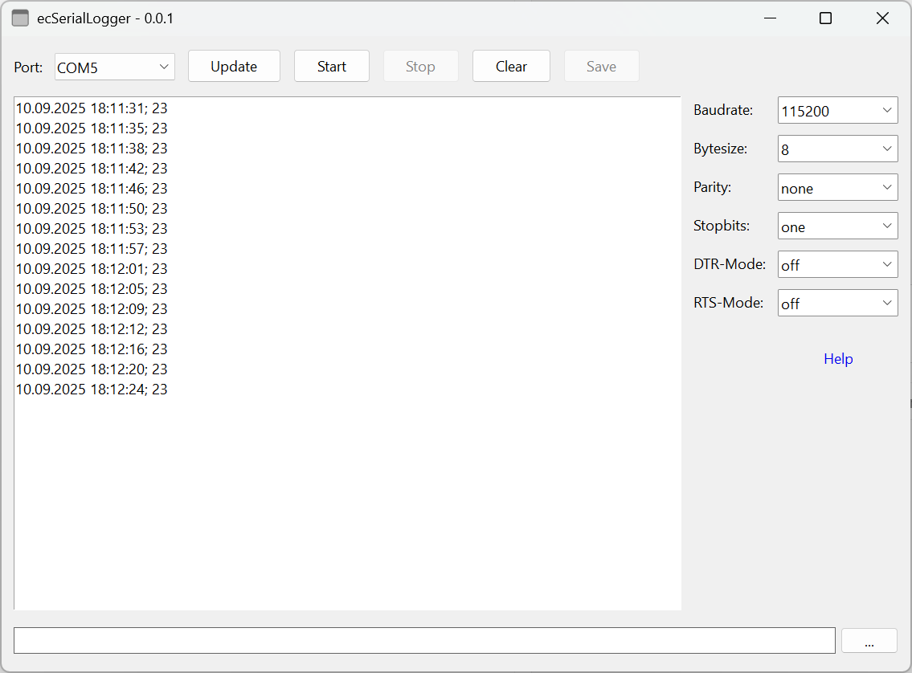

# ecSerialLogger

The ecSerialLogger application is a specialized tool for monitoring and logging communication via serial COM ports.
The received data can be saved in a text file.

> [!CAUTION]
> This application is still in the development stage.

> [!NOTE]
It was developed in [Lua](https://www.lua.org/) with the help of the windows programming framework [LuaRT](https://www.luart.org/).

> [!IMPORTANT]
> Known pugs: The baudrate and bytesize always have the same value.

